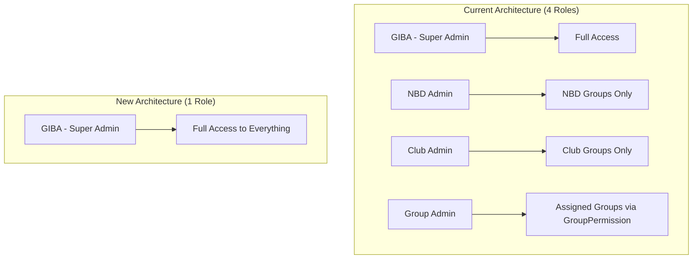
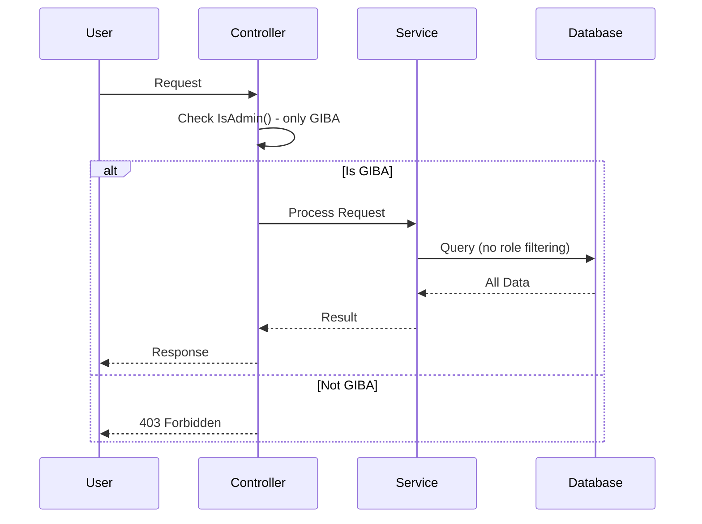

# Design Document: Simplify Role System

## Overview

Thiết kế này mô tả việc đơn giản hóa hệ thống phân quyền của MiniApp GIBA từ 4 roles (GIBA, NBD, Club, Group) xuống còn 1 role duy nhất (GIBA). GIBA admin sẽ có toàn quyền truy cập tất cả tài nguyên trong hệ thống mà không cần logic phân quyền phức tạp.

### Mục tiêu

- Loại bỏ complexity của hệ thống phân quyền đa cấp
- Giảm code maintenance burden
- Đơn giản hóa logic authorization trong toàn bộ codebase

### Phạm vi thay đổi

- Constants: `CTRole.cs`
- Controllers: `BaseCMSController.cs`, các CMS controllers
- Services: `EventService`, `ArticleService`, `ShowcaseService`, `MeetingService`, `AuthenticationService`
- Entities: `Group.cs` (remove Type field)
- Views: Admin sidebar, article views, event views
- Database: Migration để remove columns

## Architecture



### Luồng Authorization Mới



## Components and Interfaces

### 1. CTRole Constants (Simplified)

```csharp
// Before
public static class CTRole
{
    public const string Club = "Club";
    public const string NBD = "NBD";
    public const string Group = "Group";
    public const string GIBA = "GIBA";
}

// After
public static class CTRole
{
    public const string GIBA = "GIBA";
}
```

### 2. BaseCMSController (Simplified)

```csharp
public abstract class BaseCMSController : Controller
{
    protected bool IsAdmin()
    {
        return User?.IsInRole(CTRole.GIBA) ?? false;
    }

    protected bool IsSuperAdmin()
    {
        return User?.IsInRole(CTRole.GIBA) ?? false;
    }

    protected string? GetCurrentUserRole()
    {
        if (User?.IsInRole(CTRole.GIBA) == true) return CTRole.GIBA;
        return null;
    }

    // GIBA has access to all groups - always return null
    protected List<string>? GetUserGroupIdsOrNull()
    {
        return null; // No filtering needed for GIBA
    }

    // Remove GetGroupTypeFilter() - no longer needed
}
```

### 3. Service Layer Changes

Các services sẽ được đơn giản hóa bằng cách loại bỏ các case xử lý Club/NBD/Group:

```csharp
// EventService - Simplified role filtering
private async Task<IQueryable<Event>> ApplyRoleBasedFiltersAsync(...)
{
    // GIBA has full access - no filtering needed
    if (roleName == CTRole.GIBA)
    {
        return queryable; // Return all events
    }

    // Non-admin users - apply user-based filters only
    return await ApplyUserBasedFiltersAsync(queryable, query, userZaloId);
}
```

### 4. Files to Remove/Deprecate

| File                                          | Action                    |
| --------------------------------------------- | ------------------------- |
| `Services/Admins/GroupPermissionService.cs`   | Remove or mark deprecated |
| `Services/Admins/IGroupPermissionService.cs`  | Remove or mark deprecated |
| `Controller/CMS/GroupPermissionController.cs` | Remove or mark deprecated |
| `Views/GroupPermission/*`                     | Remove                    |

### 5. Files to Modify

| File                                           | Changes                           |
| ---------------------------------------------- | --------------------------------- |
| `Constants/CTRole.cs`                          | Remove Club, NBD, Group constants |
| `Controller/CMS/BaseCMSController.cs`          | Simplify all methods              |
| `Controller/CMS/EventController.cs`            | Remove Club/NBD/Group logic       |
| `Controller/CMS/GroupsController.cs`           | Remove Club/NBD/Group logic       |
| `Controller/CMS/EventGuestsController.cs`      | Remove Club/NBD/Group logic       |
| `Services/Events/EventService.cs`              | Remove Club/NBD/Group cases       |
| `Services/Articles/ArticleService.cs`          | Remove Club/NBD/Group cases       |
| `Services/ShowCase/ShowcaseService.cs`         | Remove Group role logic           |
| `Services/Meetings/MeetingService.cs`          | Remove Group role logic           |
| `Services/Authencation/AuthencationService.cs` | Remove Group claims logic         |
| `Views/Shared/components/_AdminSidebar.cshtml` | Remove Club/NBD/Group checks      |
| `Views/Article/_Article.cshtml`                | Remove Club/NBD/Group logic       |
| `Views/Event/Index.cshtml`                     | Simplify canEdit logic            |
| `Views/Sponsor/Index.cshtml`                   | Simplify canEdit logic            |
| `Views/SponsorshipTier/Index.cshtml`           | Simplify canEdit logic            |
| `Entities/Groups/Group.cs`                     | Remove Type property              |

## Data Models

### Group Entity (Modified)

```csharp
// Before
public class Group : BaseEntity
{
    public string GroupName { get; set; }
    public string? Description { get; set; }
    public string? Rule { get; set; }
    public bool IsActive { get; set; }
    public string? BehaviorRulesUrl { get; set; }
    public string? Type { get; set; }  // <-- REMOVE THIS
    public string? Logo { get; set; }
    public string? MainActivities { get; set; }
    // ...
}

// After
public class Group : BaseEntity
{
    public string GroupName { get; set; }
    public string? Description { get; set; }
    public string? Rule { get; set; }
    public bool IsActive { get; set; }
    public string? BehaviorRulesUrl { get; set; }
    // Type removed
    public string? Logo { get; set; }
    public string? MainActivities { get; set; }
    // ...
}
```

### Database Migration

```csharp
public partial class RemoveGroupTypeAndSimplifyRoles : Migration
{
    protected override void Up(MigrationBuilder migrationBuilder)
    {
        // Remove Type column from Groups table
        migrationBuilder.DropColumn(
            name: "Type",
            table: "Groups");

        // Optional: Remove GroupPermissions table if not needed
        // migrationBuilder.DropTable(name: "GroupPermissions");
    }

    protected override void Down(MigrationBuilder migrationBuilder)
    {
        migrationBuilder.AddColumn<string>(
            name: "Type",
            table: "Groups",
            type: "nvarchar(max)",
            nullable: true);
    }
}
```

## Correctness Properties

_A property is a characteristic or behavior that should hold true across all valid executions of a system-essentially, a formal statement about what the system should do. Properties serve as the bridge between human-readable specifications and machine-verifiable correctness guarantees._

### Property 1: GIBA-Only Authorization

_For any_ user context in the CMS, the IsAdmin() method should return true if and only if the user has the GIBA role.
**Validates: Requirements 2.1, 2.2**

### Property 2: Full Access for GIBA in EventService

_For any_ event query with GIBA role, the service should return all events without role-based filtering (only user-specified filters apply).
**Validates: Requirements 3.1**

### Property 3: Full Access for GIBA in ArticleService

_For any_ article query with GIBA role, the service should return all articles without role-based filtering.
**Validates: Requirements 3.2**

### Property 4: Full Access for GIBA in ShowcaseService

_For any_ showcase query with GIBA role, the service should return all showcases without role-based filtering.
**Validates: Requirements 3.3**

### Property 5: Full Access for GIBA in MeetingService

_For any_ meeting query with GIBA role, the service should return all meetings without role-based filtering.
**Validates: Requirements 3.4**

### Property 6: GetUserGroupIdsOrNull Always Returns Null

_For any_ GIBA user, GetUserGroupIdsOrNull() should always return null, indicating full access to all groups.
**Validates: Requirements 2.3**

## Error Handling

### Authorization Errors

- Non-GIBA users attempting CMS access: Return 403 Forbidden
- Invalid role in token: Redirect to login page
- Missing authentication: Redirect to login page

### Migration Errors

- If Type column removal fails: Rollback migration
- If data exists with Type values: Migration should still succeed (nullable column)

## Testing Strategy

### Dual Testing Approach

#### Unit Tests

- Test `IsAdmin()` returns true only for GIBA role
- Test `GetCurrentUserRole()` returns only GIBA or null
- Test `GetUserGroupIdsOrNull()` always returns null for GIBA
- Test service methods don't filter by role for GIBA users

#### Property-Based Tests

- Use xUnit with FsCheck or similar PBT library for .NET
- Configure minimum 100 iterations per property test
- Tag each test with corresponding property number

### Test Framework

- **Unit Testing**: xUnit
- **Property-Based Testing**: FsCheck (for .NET)
- **Mocking**: Moq

### Property Test Examples

```csharp
// **Feature: simplify-role-system, Property 1: GIBA-Only Authorization**
[Property]
public Property IsAdmin_OnlyTrueForGIBA(string roleName)
{
    // Arrange
    var user = CreateMockUserWithRole(roleName);
    var controller = new TestController(user);

    // Act
    var result = controller.IsAdmin();

    // Assert
    return (result == (roleName == CTRole.GIBA)).ToProperty();
}

// **Feature: simplify-role-system, Property 6: GetUserGroupIdsOrNull Always Returns Null**
[Property]
public Property GetUserGroupIdsOrNull_AlwaysNullForGIBA()
{
    // Arrange
    var user = CreateMockUserWithRole(CTRole.GIBA);
    var controller = new TestController(user);

    // Act
    var result = controller.GetUserGroupIdsOrNull();

    // Assert
    return (result == null).ToProperty();
}
```

### Integration Tests

- Test full request flow with GIBA user accessing all resources
- Test migration runs successfully
- Test existing data is handled correctly after migration
